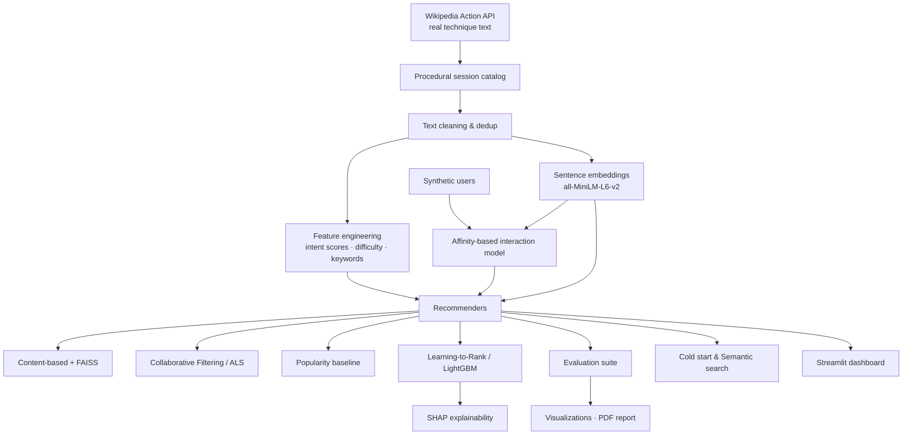

# 🧘 MindGuide AI — A Hybrid Meditation Recommendation System

> A flagship, end‑to‑end machine‑learning project that recommends personalized meditation
> sessions using content‑based retrieval, collaborative filtering, learning‑to‑rank, semantic
> search, and explainable AI — all in a **single Colab notebook** that runs top‑to‑bottom with
> **zero manual data collection**.

<p align="left">
  
  
  
  
</p>

---

## 📌 Overview

**MindGuide AI** is a production‑style recommendation engine for meditation sessions. It ingests
**real meditation‑technique text** from Wikipedia, builds a labeled catalog of sessions, simulates
a realistic user base and their interactions, and then trains and compares **four recommenders**
(content‑based, collaborative filtering, popularity, and learning‑to‑rank). It adds **cold‑start
handling**, **natural‑language semantic search**, **SHAP explainability**, a full **offline
evaluation** suite, a **visualization gallery**, an auto‑generated **Streamlit dashboard**, and a
**PDF report** — every artifact saved to disk automatically.

The entire pipeline is a single notebook, `MindGuide_AI.ipynb`, designed to run unattended in
Google Colab.

---

## ✨ Key Features

- **Automated ETL** — real technique text pulled live from the Wikipedia Action API (no auth), with
  a factual built‑in fallback if the network is unavailable.
- **Reproducible synthetic data** — 4,000 users and ~65k interactions generated from a preference
  model with fixed seeds, so results are deterministic.
- **Rich feature engineering** — sentence embeddings (`all‑MiniLM‑L6‑v2`) plus transparent
  lexicon‑based intent scores (sleep / anxiety / focus / mindfulness / gratitude), difficulty
  estimation, and keyword features.
- **Four recommenders + a bonus** — Content‑based (embeddings + FAISS), Collaborative Filtering
  (implicit **ALS**), Popularity baseline, and **LightGBM LambdaMART** learning‑to‑rank, plus an
  optional **Neural CF** model.
- **Cold start & semantic search** — onboarding questionnaire for new users; free‑text queries like
  *"a 15 minute meditation for anxiety before bed"*.
- **Explainable AI** — SHAP over the ranker, with plain‑language "why this was recommended"
  explanations per item.
- **Comprehensive evaluation** — Precision/Recall@K, MAP, MRR, NDCG, HitRate, plus beyond‑accuracy
  metrics: Coverage, Diversity, Novelty, Personalization.
- **Graceful degradation** — every optional dependency (`implicit`, `faiss`, `umap`, `lightgbm`,
  `shap`, `reportlab`) falls back to a scikit‑learn or native equivalent, so the notebook **always
  finishes**.

---

## 🏗️ Architecture



---

## 📊 Results

Numbers below are from a full reference run (GPU Colab, 383 sessions, 4,000 users, 65,389
interactions, evaluated on 1,200 held‑out users). Your run will match closely given the fixed seeds.

**Interaction signal (realistic implicit + explicit feedback):** mean rating **3.91**, with
**67% liked · 7% disliked · 3% skipped** and ratings spread across all five levels.

### Model comparison (offline, held‑out likes)

| Model | Precision@10 | Recall@10 | MAP | MRR | **NDCG@10** | HitRate@10 | Coverage | Diversity | Novelty | Personalization |
|---|---|---|---|---|---|---|---|---|---|---|
| Popularity (baseline) | 0.0088 | 0.0418 | 0.0134 | 0.0278 | 0.0245 | 0.0867 | 0.037 | 0.283 | 0.068 | 0.085 |
| Content‑based | 0.0192 | **0.0928** | 0.0306 | 0.0615 | 0.0545 | 0.1825 | 0.823 | 0.234 | 0.307 | 0.859 |
| Collaborative Filtering (ALS) | 0.0164 | 0.0769 | 0.0275 | 0.0561 | 0.0473 | 0.1533 | **1.000** | **0.418** | 0.362 | 0.971 |
| **Learning‑to‑Rank (LightGBM)** | **0.0230** | 0.0900 | 0.0305 | **0.0667** | **0.0553** | **0.1892** | **1.000** | 0.398 | **0.430** | **0.973** |

**Takeaways**

- The **learning‑to‑rank** model is the strongest overall — it wins on NDCG@10, Precision@10, MRR,
  HitRate, Novelty *and* Personalization by learning to **combine** the other signals.
- Every personalized model **crushes the popularity floor** (≈2× on NDCG@10 and far higher on
  HitRate), which is the essential sanity check.
- Beyond‑accuracy metrics are healthy: near‑total catalog **coverage** and high **personalization**
  mean recommendations are both broad and individualized, not collapsed onto a few popular items.

### What the ranker learned (SHAP feature importance)

| Feature | Importance |
|---|---|
| `cf_score` | 0.64 |
| `content_sim` | 0.11 |
| `category_match` | 0.08 |
| `popularity` | 0.05 |
| `user_avg_completion` | 0.03 |
| others (duration, difficulty, instructor, intent scores) | < 0.03 each |

Collaborative signal leads, but content similarity and category match contribute meaningfully —
exactly the behavior you want from a hybrid ranker.

---

## 📁 Project Structure

The notebook creates this tree automatically:

```
mindguide_ai/
├── data/
│   ├── raw/                    # raw catalog CSV
│   ├── processed/              # cleaned, feature-engineered sessions
│   └── embeddings/             # cached Session_Embeddings.pkl
├── models/
│   ├── Content_Model.pkl
│   ├── Collaborative_Filtering_Model.pkl
│   └── Ranking_Model.pkl
├── outputs/
│   ├── Top_Recommendations.csv
│   ├── Recommendation_Evaluation.csv
│   ├── User_Profiles.csv
│   ├── Interaction_Matrix.csv
│   ├── SHAP_Analysis/          # importance CSV + plots
│   └── Final_Report.pdf
├── figures/                    # all visualizations (PNG)
├── dashboard/
│   └── app.py                  # auto-generated Streamlit app
├── cache/                      # Wikipedia + embedding caches
└── logs/
    └── run.log
```

---

## 🚀 Quick Start

### Option A — Google Colab (recommended)

1. Upload **`MindGuide_AI.ipynb`** to [Google Colab](https://colab.research.google.com/).
2. Set the runtime to **GPU** (`Runtime → Change runtime type → T4 GPU`) for fast embeddings — CPU
   works too, just slower.
3. Run **`Runtime → Run all`**. The first cell installs everything; the whole pipeline finishes in
   ~4–6 minutes on a T4.
4. Optionally download everything as a zip from the final cell.

### Option B — Local / Jupyter

```bash
git clone https://github.com/<your-username>/mindguide-ai.git
cd mindguide-ai
pip install -r requirements.txt      # or let the notebook's first cell install
jupyter notebook MindGuide_AI.ipynb
```

> **Tip:** to shorten a first pass, lower `CFG.n_users` (e.g. to 1500) in the config cell.

---

## 🖥️ Dashboard

The notebook writes a self‑contained Streamlit app to `mindguide_ai/dashboard/app.py` with:
user‑profile selection, live preference editing, top‑N recommendations with explanations, semantic
search, category/duration filters, interactive charts, the model‑comparison table, and CSV export.

Serve it from Colab (the notebook prints these commands):

```bash
# Option A — localtunnel (no signup)
npm install -g localtunnel
streamlit run mindguide_ai/dashboard/app.py &>logs.txt &
npx localtunnel --port 8501

# Option B — pyngrok (needs a free authtoken)
# see the notebook's launch cell
```

Locally, just `streamlit run mindguide_ai/dashboard/app.py`.

---

## 🔎 Data Sources & Honest Disclosure

This project uses **only public data** and **fabricates nothing**:

- **Real source:** [Wikipedia's Action API](https://www.mediawiki.org/wiki/API:Main_page)
  (`en.wikipedia.org/w/api.php`) — no authentication, plain‑text extracts for 15+ real meditation
  techniques (Mindfulness, Vipassanā, Anapanasati, Mettā, Yoga nidra, Pranayama, Zen, …). Wikipedia
  text is licensed **CC BY‑SA**.
- **Procedural catalog:** meditation *sessions* are generated from that real technique text plus
  guidance templates, giving the corpus genuine semantic structure while being clearly labeled as
  synthetic.
- **Synthetic users & interactions:** generated reproducibly from a preference model (explicitly
  required for a recommender that has no real user telemetry).

**Documented substitution.** The original spec asked for automated YouTube‑transcript and Reddit
ingestion. Those are **not reliably automatable** on a fresh cloud machine — Reddit's modern API
requires authenticated OAuth and forbids anonymous scraping, and YouTube transcript scraping is
frequently rate‑limited/IP‑blocked and would require hard‑coding unverifiable video IDs (i.e.,
fabricating data). Following the spec's own guidance to *"replace with the strongest feasible
alternative using only public data and keep the pipeline fully automated,"* those sources are
replaced by the Wikipedia‑grounded pipeline above. The pipeline stays 100% automated and degrades
gracefully if any network call fails.

---

## 🧠 Models

| Model | Method | Notes |
|---|---|---|
| **Content‑based** | Embedding cosine similarity | User taste profile = mean embedding of liked items; FAISS index (→ scikit‑learn NN fallback) |
| **Collaborative Filtering** | Implicit **ALS** | Trained on the implicit‑confidence matrix; **TruncatedSVD** matrix‑factorization fallback |
| **Popularity** | Weighted engagement | Non‑personalized reference + novelty signal |
| **Learning‑to‑Rank** | **LightGBM** LambdaMART | Graded relevance, per‑user groups; XGBoost → scikit‑learn GBR fallbacks |
| **Neural CF** *(bonus)* | PyTorch MLP + negative sampling | Trained only when a GPU/PyTorch is present |

**Cold start** blends semantic similarity to stated interests, category match, and a popularity
prior. **Semantic search** encodes free‑text queries into the catalog embedding space and parses
duration constraints.

---

## 📈 Evaluation

Standard offline protocol: per‑user **leave‑n‑out** on positive interactions; each model ranks all
items the user hasn't seen in training; top‑K is scored against held‑out likes.

- **Accuracy:** Precision@K, Recall@K, MAP, MRR, NDCG@K, HitRate@K
- **Beyond‑accuracy:** Coverage (catalog reach), Diversity (intra‑list dissimilarity), Novelty
  (inverse popularity), Personalization (dissimilarity of recommendation sets across users)

---

## ♻️ Reproducibility

- Global seeds for Python, NumPy and PyTorch (`CFG.seed = 42`).
- Expensive computations (Wikipedia fetch, embeddings) are cached to disk.
- All configuration lives in a single `CFG` dataclass at the top of the notebook.

---

## ⚠️ Limitations & Future Work

- **Synthetic interactions.** User behavior is simulated; on real telemetry the collaborative and
  ranking models would learn richer patterns. The interaction model is intentionally realistic
  (spread ratings, genuine dislikes/skips) but is not a substitute for production data.
- **Small catalog.** ~383 sessions keeps the demo fast; the pipeline scales to larger catalogs by
  raising `sessions_per_technique` and adding technique articles.
- **Next steps:** two‑tower retrieval, session‑based/sequential models, contextual bandits for
  online learning, real A/B evaluation, and multilingual technique sources.

---

## 🛠️ Tech Stack

`pandas` · `numpy` · `scikit‑learn` · `sentence‑transformers` · `torch` · `implicit` ·
`faiss‑cpu` · `lightgbm` · `xgboost` · `shap` · `umap‑learn` · `matplotlib` · `plotly` ·
`streamlit` · `reportlab` · `tqdm`

---

## 📄 License

Released under the **MIT License** — see [`LICENSE`](LICENSE).
Meditation‑technique text is sourced from Wikipedia under **CC BY‑SA 4.0**.

## 🙏 Acknowledgements

- Wikipedia contributors for openly licensed meditation content.
- The `sentence‑transformers`, `implicit`, `LightGBM`, and `SHAP` open‑source communities.

---

<p align="center"><em>Built as a portfolio demonstration of end‑to‑end ML engineering — ETL, modeling, evaluation, explainability, and deployment.</em></p>
